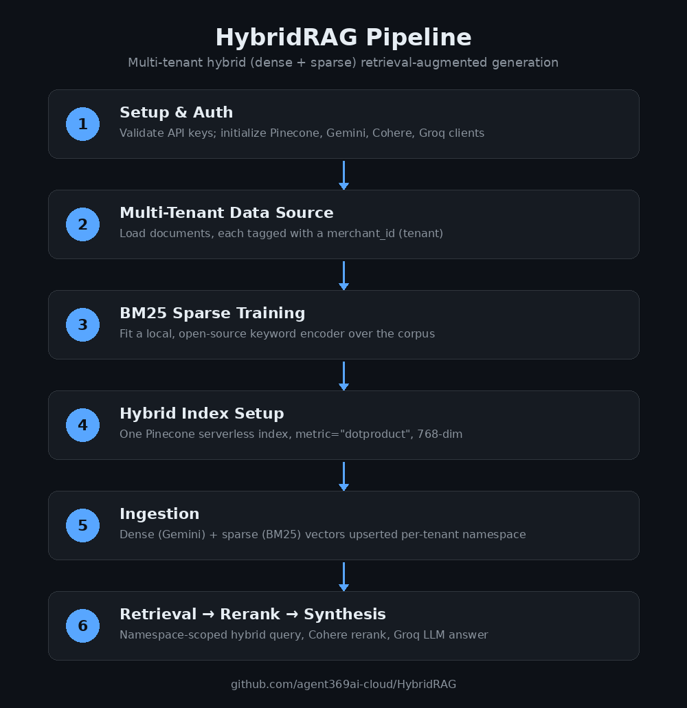
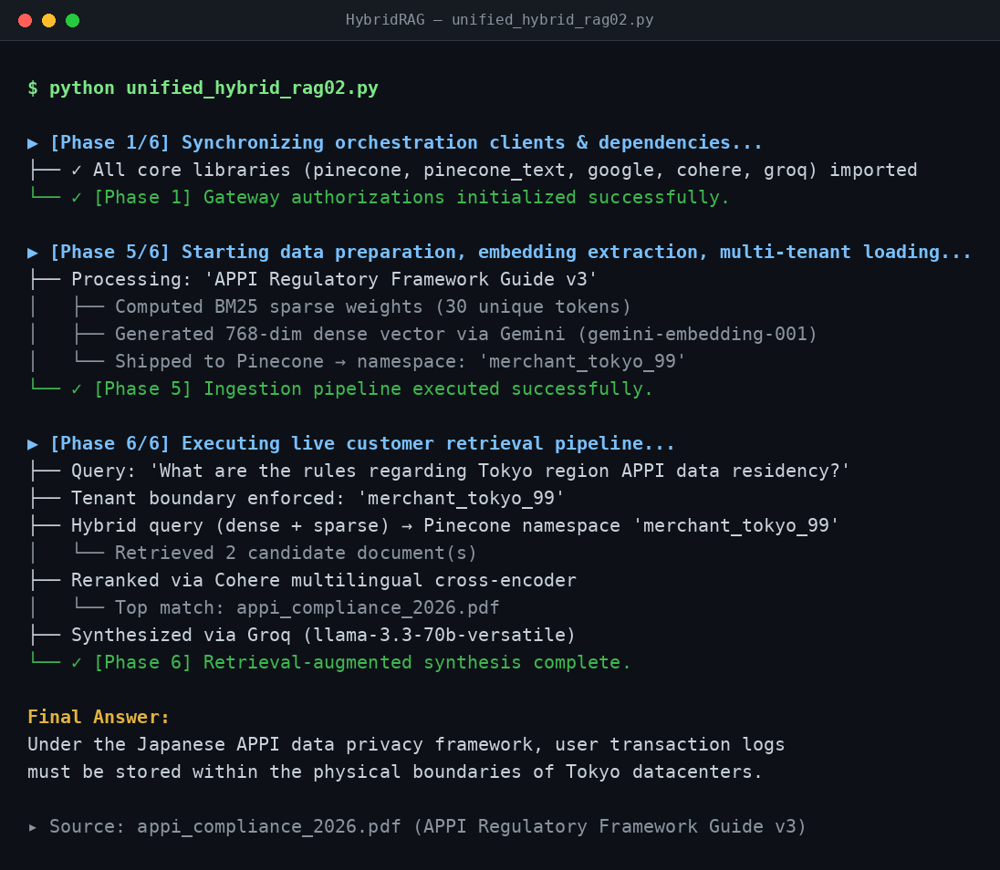

# HybridRAG

A multi-tenant Hybrid Retrieval-Augmented Generation (RAG) pipeline that combines dense semantic search with sparse keyword search in a single Pinecone index, then reranks and synthesizes a grounded answer.



## Pipeline overview

The pipeline (`unified_hybrid_rag02.py`) runs in six phases:

1. **Setup** — validates required API keys and initializes clients for Pinecone, Gemini, Cohere, and Groq.
2. **Data source** — loads a mock multi-tenant document set (each document tagged with a `merchant_id`), simulating a per-tenant cloud storage layout.
3. **Sparse tokenizer training** — fits a local, open-source BM25 encoder (`pinecone-text`) over the document corpus, so keyword search requires no external search service.
4. **Index setup** — creates (or connects to) a single Pinecone serverless index configured for **native hybrid search** (`metric="dotproduct"`, 768 dimensions).
5. **Ingestion** — for each document: computes BM25 sparse weights, generates a dense embedding via Gemini (`gemini-embedding-001`, truncated to 768 dims), and upserts both into Pinecone **under a namespace scoped to the document's tenant** (multi-tenant isolation).
6. **Retrieval + synthesis** — embeds the incoming query (dense + sparse), queries Pinecone *within the requesting tenant's namespace only*, reranks the candidates with Cohere's multilingual cross-encoder, and asks Groq (`llama-3.3-70b-versatile`) to synthesize a final answer grounded strictly in the top-ranked document.

## Why hybrid + multi-tenant?

- **Hybrid search** (dense + sparse in one query) improves recall for both semantic queries and exact keyword/entity matches, without running two separate search systems.
- **Namespace-scoped retrieval** enforces tenant data isolation at the database level — a query for one merchant can never surface another merchant's documents, even accidentally.

## Setup

```bash
python -m venv .venv
source .venv/bin/activate
pip install pinecone-client pinecone-text google-genai cohere groq python-dotenv
```

Copy the example environment file and fill in your real keys:

```bash
cp .env.example .env
# edit .env with your actual API keys
```

Required keys:

| Variable | Where to get it |
|---|---|
| `PINECONE_API_KEY` | [app.pinecone.io](https://app.pinecone.io) |
| `GEMINI_API_KEY` | [aistudio.google.com/apikey](https://aistudio.google.com/apikey) — must have access to `gemini-embedding-001` |
| `COHERE_API_KEY` | [dashboard.cohere.com](https://dashboard.cohere.com) |
| `GROQ_API_KEY` | [console.groq.com](https://console.groq.com) |

`.env` is git-ignored — never commit real keys.

## Usage

```bash
python unified_hybrid_rag02.py
```

The script is self-contained: it provisions the Pinecone index if it doesn't exist, ingests the sample multi-tenant documents, then runs a sample query (`"What are the rules regarding Tokyo region APPI data residency?"`) scoped to the `merchant_tokyo_99` namespace and prints the synthesized answer with its source citation.

To query your own data, replace `enterprise_blob_storage_mock` (Phase 2) with your real document loader, and change `eval_query` / `isolated_tenant_target` (Phase 6) to the incoming user question and tenant.

### Sample run



## Files

- `unified_hybrid_rag02.py` — the current, complete pipeline (ingestion + retrieval + rerank + synthesis).
- `unified_hybrid_rag.py` — earlier draft, kept for reference; superseded by `unified_hybrid_rag02.py`.
- `1.Step.ipynb` — exploratory notebook.
- `.env.example` — template for required environment variables.
